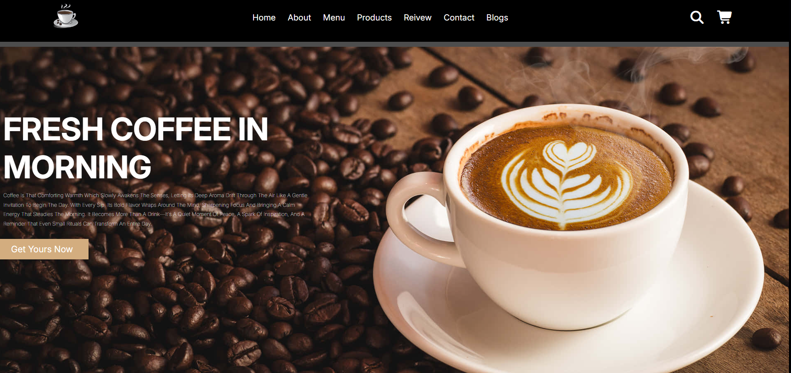
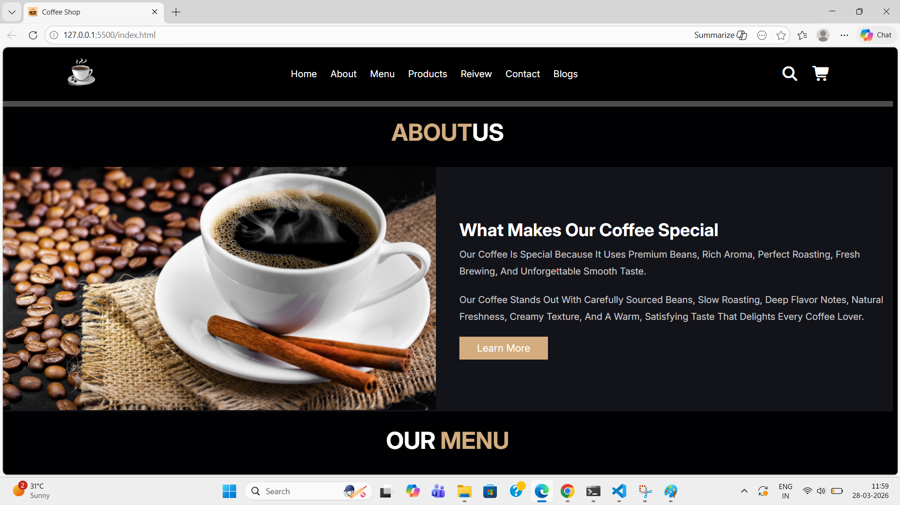
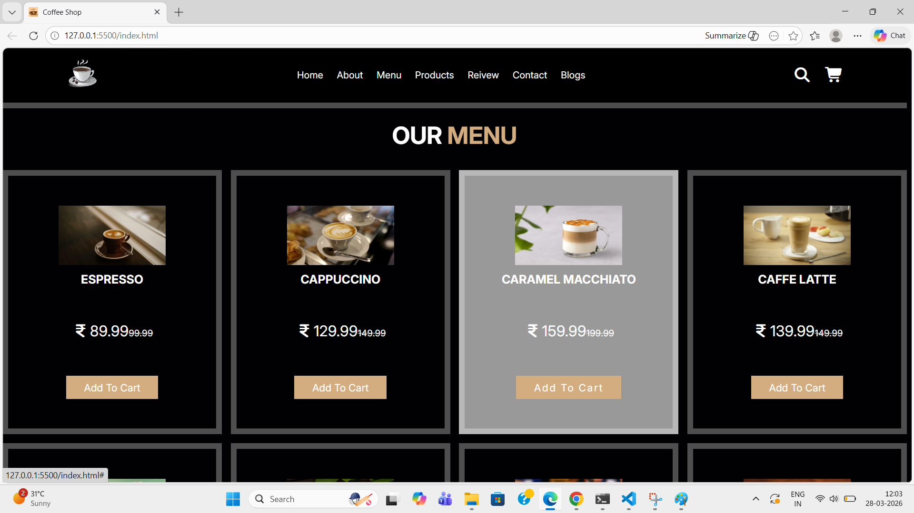
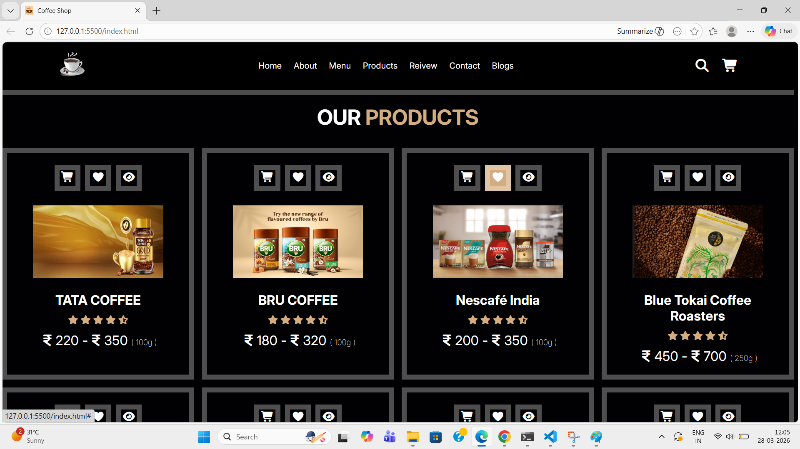
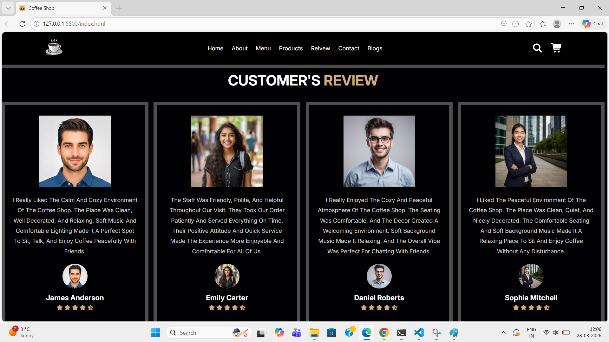
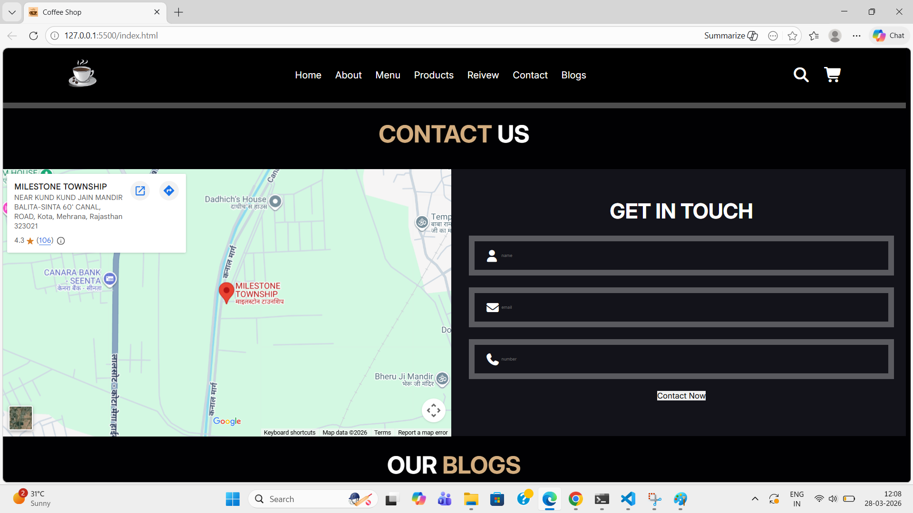
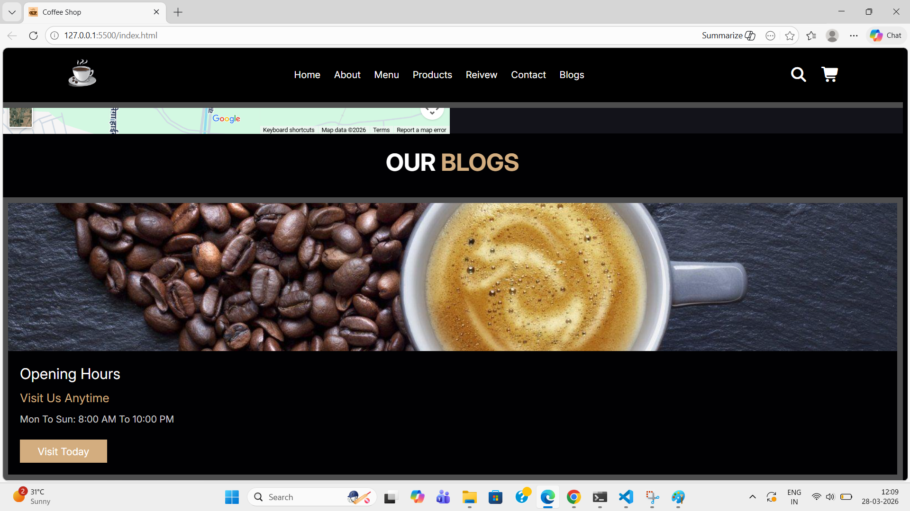

☕ Coffee Shop Website

A modern, fully responsive Coffee Shop website built using HTML5, CSS3, and JavaScript. This project showcases a clean UI design, smooth user experience, and mobile-friendly layout suitable for real-world business use.

🚀 Features  
📱 Fully Responsive Design (Mobile, Tablet, Desktop)  
🎨 Modern and Clean User Interface  
⚡ Smooth scrolling and interactive elements  
🛒 Menu section with attractive layout  
📍 Contact and location section  
🔥 Fast loading and optimized performance  
 
🛠️ Technologies Used  
✅ HTML5  
✅ CSS3 (Flexbox & Grid)  
✅ JavaScript (ES6+)    
🎯 Purpose  

This project was created to improve front-end development skills and to demonstrate the ability to build a real-world responsive website.  

📸 Preview  

Home Page --  
  
 
About Us Page  
  
 
Home Page --  
  
 
Home Page --  
  
 
Home Page --  
  
 
Home Page --  
  
 
Home Page --  
  
 

🌐 Live Demo  

(Add your deployed link here)
